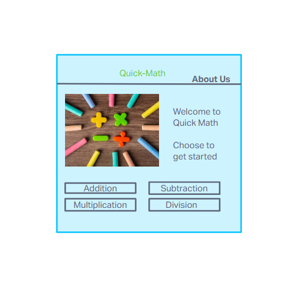
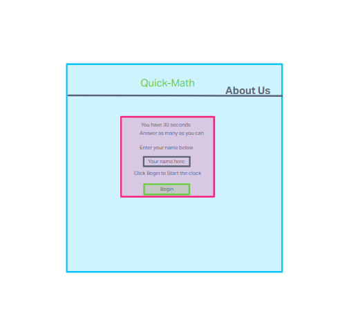
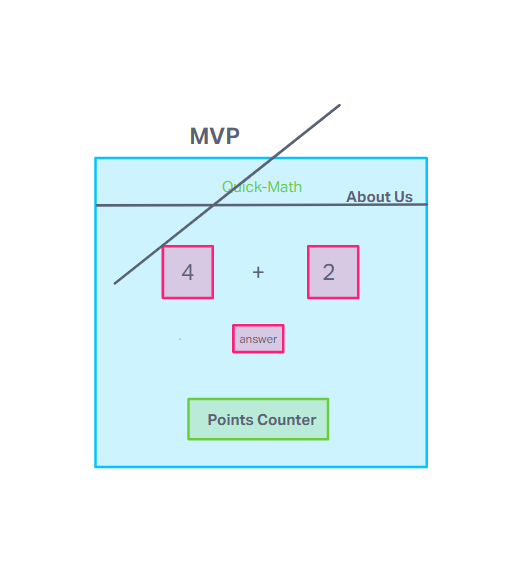
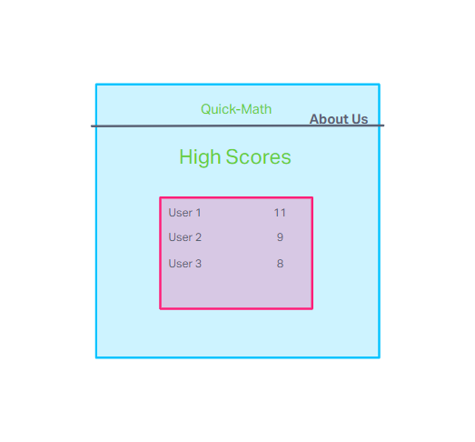

# Quick-Math

- Developed for Quick-Learners by

- Khari Hopes, Angel Turks, and Caleb McKinney

- A fun math game to help learn and practice math skills.

- The Quick-Learners company develops apps and games to make learning fun and easy for children and adults. In Quick-Math users will have 30 seconds to answer as many multiple choice math questions as possible.

- Users will earn points for each correct answer and will earn a reward at the end of the round based on their score. They will also be able to see where they place on our leaderboard.

- Users will earn points for each correct answer and will earn a reward at the end of the round based on their score. They will also be able to see where they place on our leaderboard.

Sources
https://quick-learners.github.io/Quick-Math/
https://github.com/Quick-Learners/Quick-Math
https://youtu.be/LAaf7-WuJJQ?si=bMXC1P3eKnWL_MDp
StackOverflow
https://www.w3schools.com/howto/howto_js_countdown.asp
https://codingartistweb.com/2022/08/math-game-with-javascript/
https://www.tutorialspoint.com/How-to-redirect-to-another-webpage-using-JavaScript
https://www.w3schools.com/js/js_random.asp
https://chat.openai.com/c/643d585b-0d0e-4bc3-985f-aec07b91f194
https://stackoverflow.com/questions/14821087/horizontal-line-and-right-way-to-code-it-in-html-css

MIT License

Copyright (c) 2023 Quick-Learners

Permission is hereby granted, free of charge, to any person obtaining a copy
of this software and associated documentation files (the "Software"), to deal
in the Software without restriction, including without limitation the rights
to use, copy, modify, merge, publish, distribute, sublicense, and/or sell
copies of the Software, and to permit persons to whom the Software is
furnished to do so, subject to the following conditions:

The above copyright notice and this permission notice shall be included in all
copies or substantial portions of the Software.

THE SOFTWARE IS PROVIDED "AS IS", WITHOUT WARRANTY OF ANY KIND, EXPRESS OR
IMPLIED, INCLUDING BUT NOT LIMITED TO THE WARRANTIES OF MERCHANTABILITY,
FITNESS FOR A PARTICULAR PURPOSE AND NONINFRINGEMENT. IN NO EVENT SHALL THE
AUTHORS OR COPYRIGHT HOLDERS BE LIABLE FOR ANY CLAIM, DAMAGES OR OTHER
LIABILITY, WHETHER IN AN ACTION OF CONTRACT, TORT OR OTHERWISE, ARISING FROM,
OUT OF OR IN CONNECTION WITH THE SOFTWARE OR THE USE OR OTHER DEALINGS IN THE
SOFTWARE.

